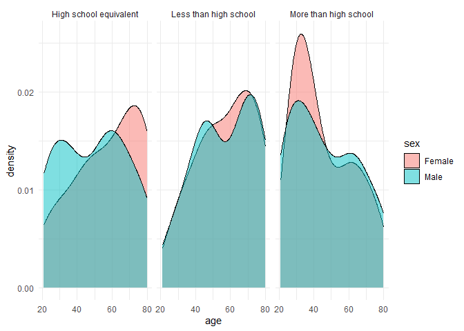

p8105_hw3_tl3279
================
Tianqi Li
2024-10-09

Load all necessary packages

## Problem 1

Load the dataset

``` r
data("ny_noaa")
```

Exploration of dataset

``` r
str(ny_noaa)
```

    ## tibble [2,595,176 × 7] (S3: tbl_df/tbl/data.frame)
    ##  $ id  : chr [1:2595176] "US1NYAB0001" "US1NYAB0001" "US1NYAB0001" "US1NYAB0001" ...
    ##  $ date: Date[1:2595176], format: "2007-11-01" "2007-11-02" ...
    ##  $ prcp: int [1:2595176] NA NA NA NA NA NA NA NA NA NA ...
    ##  $ snow: int [1:2595176] NA NA NA NA NA NA NA NA NA NA ...
    ##  $ snwd: int [1:2595176] NA NA NA NA NA NA NA NA NA NA ...
    ##  $ tmax: chr [1:2595176] NA NA NA NA ...
    ##  $ tmin: chr [1:2595176] NA NA NA NA ...
    ##  - attr(*, "spec")=
    ##   .. cols(
    ##   ..   id = col_character(),
    ##   ..   date = col_date(format = ""),
    ##   ..   prcp = col_integer(),
    ##   ..   snow = col_integer(),
    ##   ..   snwd = col_integer(),
    ##   ..   tmax = col_character(),
    ##   ..   tmin = col_character()
    ##   .. )

``` r
ny_noaa =
  ny_noaa|>
  mutate(
    tmax = as.numeric(tmax),
    tmin = as.numeric(tmin)
    )
summary(ny_noaa)
```

    ##       id                 date                 prcp               snow       
    ##  Length:2595176     Min.   :1981-01-01   Min.   :    0.00   Min.   :  -13   
    ##  Class :character   1st Qu.:1988-11-29   1st Qu.:    0.00   1st Qu.:    0   
    ##  Mode  :character   Median :1997-01-21   Median :    0.00   Median :    0   
    ##                     Mean   :1997-01-01   Mean   :   29.82   Mean   :    5   
    ##                     3rd Qu.:2005-09-01   3rd Qu.:   23.00   3rd Qu.:    0   
    ##                     Max.   :2010-12-31   Max.   :22860.00   Max.   :10160   
    ##                                          NA's   :145838     NA's   :381221  
    ##       snwd             tmax              tmin        
    ##  Min.   :   0.0   Min.   :-389.0    Min.   :-594.0   
    ##  1st Qu.:   0.0   1st Qu.:  50.0    1st Qu.: -39.0   
    ##  Median :   0.0   Median : 150.0    Median :  33.0   
    ##  Mean   :  37.3   Mean   : 139.8    Mean   :  30.3   
    ##  3rd Qu.:   0.0   3rd Qu.: 233.0    3rd Qu.: 111.0   
    ##  Max.   :9195.0   Max.   : 600.0    Max.   : 600.0   
    ##  NA's   :591786   NA's   :1134358   NA's   :1134420

The dataset consists of 7 variables with 2,595,176 observations. The
variables includes: id: Weather station ID date: Date of observation
prcp: Precipitation (tenths of mm) snow: Snowfall (mm) snwd: Snow depth
(mm) tmax: Maximum temperature (tenths of degrees C) tmin: Minimum
temperature (tenths of degrees C) About half of the dataset consists of
missing data for tmin and tmax which can be an issue if analyze as a
whole.

Data cleaning

``` r
ny_noaa_cleaned = 
  ny_noaa |>
  janitor::clean_names() |>
  mutate(
    year = year(date),
    month = month(date),
    day = day(date),
    prcp = prcp / 10,
    tmax = tmax / 10, 
    tmin = tmin / 10  
  )
ny_noaa_cleaned |>
  filter(!is.na(snow)) |>
  count(snow, , sort = TRUE) |>
  slice(1)
```

    ## # A tibble: 1 × 2
    ##    snow       n
    ##   <int>   <int>
    ## 1     0 2008508

The year, month, and day variables have been creatted using the
lubridate package. Variables with tenth of a standard units have been
divided by 10. For snowfall, the most commonly observed value is 0 as
snowfall does not occur on most days throughout the year in most
locations.

Make a two-panel plot showing the average max temperature in January and
in July in each station across years. Is there any observable /
interpretable structure? Any outliers?

## Problem 2

Load the datasets and merge them

``` r
demo_df = 
  read_csv("nhanes_covar.csv", na = c("NA", "", "."), skip = 4) |>
  janitor::clean_names() |>
  filter(age >= 21) |>
  mutate(
    sex = case_match(sex, 
                    1 ~ "Male", 
                    2 ~ "Female"),
    education = case_match(education, 
                       1 ~ "Less than high school", 
                       2 ~ "High school equivalent", 
                       3 ~ "More than high school")
  ) |>
  drop_na()

accel_df = 
  read_csv("nhanes_accel.csv",na = c("NA", "", ".")) |>
  janitor::clean_names() 

merged_df = 
  accel_df |>
  inner_join(demo_df, by = "seqn")
```

Create the table

``` r
sex_edu = 
  merged_df |>
  count(sex, education) |>
  pivot_wider(names_from = sex, values_from = n)

kable(sex_edu)
```

| education              | Female | Male |
|:-----------------------|-------:|-----:|
| High school equivalent |     23 |   35 |
| Less than high school  |     28 |   27 |
| More than high school  |     59 |   56 |

``` r
merged_df |>
  ggplot(aes(x = age, fill = sex)) +
  geom_density(alpha = 0.5) +
  facet_wrap(~education) +
  theme_minimal()
```

<!-- -->
